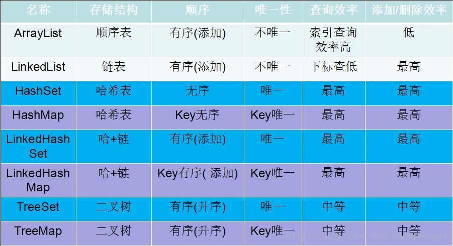

# 03. Longest Substring Without Repeating Characters

### Solution-1 O\(n\)

```java
public class Solution {
    public int lengthOfLongestSubstring(String s) {
        HashSet<Character> set = new HashSet<>();
        int n = s.length();
        int i = 0,j = 0,max = 0;
        
        while(i < n && j < n){
            if(!set.contains(s.charAt(j))){
                set.add(s.charAt(j++));
                max = Math.max(max,j-i);//jはすでに+1だからそのままでいい
                //--------------------------------
                // for(Object obj : set)
                //     System.out.print(obj);
                // System.out.println();
                //--------------------------------
            }
            else
                set.remove(s.charAt(i++));
        }
        return max;
    }
}
/*思路
  用一个大循环和两个指针i和j找出不重复的sub字符串，（i=0,j=0;j<n;j++）
  首先j从第一个开始顺序将字符放入hashset，j++，i不动，
  那么j-i就应该是当前sub字符串的长度。
  若表内存在当前将要放入的字符，则删除第一个放入hashset的字符i++
  继续判断是否重复。若还重复则继续删除直到新字符串中的字符互不重复。
  这里的用意在于找到能存放当前字符且和之前存入hashset里的字符互不重复的新的sub字符串。
  新的sub字符串产生后j继续走，以此类推直到字符串结尾就可以找到最大不重复长度。
*/
/*
  优点，只需要一次遍历就可以得到结果，减去solution2中的重复动作，
  时间和空间复杂度上都好很多
  缺点，比如下面例子
  [bcad]agepo
  找到了前四个为不重复的字符串，第五个a和第三个重复，应该从d开始往后走
  判断后面的是否不重复，但是该程序不知道和a重复的是第几个，
  所以一个一个的删，变成
  [cad]a
  [ad]a
  [d]a
  直到da这一步才终于找到与a相同的在哪，这样就做了很多逻辑上无用的事情。
*/

//用for的写法，循环部分
        for(int i = 0,j = 0; j < n;){
            if(!set.contains(s.charAt(j)))
                set.remove(s.charAt(i++));
            else
                set.add(s.charAt(j++));
            ans = Math.max(ans,j-i);
        }
```

### Solution-2 O\(n^3\)

```java
public class Solution {
    public int lengthOfLongestSubstring(String s) {
        int max = 0; int n = s.length();
        for(int i = 0; i < n; i++){
            for(int j = i+1; j <= n; j++){
                if(Unique(i,j,s)){
                    max = Math.max(j-i,max);
                }
            }
        }
        return max;
    }
    public boolean Unique(int start,int end,String s){
        HashSet<Character> set = new HashSet<>();
        
        for(int i = start; i < end; i++){
            if(set.contains(s.charAt(i))){
                System.out.print("!");
                return false;
            }
                set.add(s.charAt(i));
        }
        Iterator<Character> ir = set.iterator();
        while(ir.hasNext()){
            System.out.print(ir.next() + " ");
        }
        System.out.println();
        return true;
    }
}
/*思路
  从字符串的开头开始遍历，判断第一个字母到第二个字母所构成的
  sub字符串是否重复，第一个到第三个，以此类推。这是一个大循环。
  然后判断从第二个字母开始到第三个字母是否重复，以此类推。
  直到所有循环结束，遍历了字符串从任意一个字母开始到最后一个字母
  所构成的sub字符串是否包含重复字符。
  期间不断更新不重复的sub字符串的开头索引i及末尾索引j的差到结果
*/
/*
  优点，简单暴力不需要借助其他工具容易理解。
  缺点，时间及空间复杂度过高，每次判断重复都需要新建一个哈希set
*/
```

### solution-3 O\(n\) 

```java
//fast than solution2
public class Solution {
    public int lengthOfLongestSubstring(String s) {
        //HashMap<type(key),type(value)>
        HashMap<Character,Integer> map = new HashMap<>();
        int n = s.length();int max = 0;
        
        for(int i = 0,j = 0; j < n; j ++){
            if(map.containsKey(s.charAt(j)))
                i = Math.max(map.get(s.charAt(j)),i);
            max = Math.max(max,j-i+1);
            map.put(s.charAt(j),j+1);
        }
        return max;
    }
}
//https://www.cnblogs.com/prayjourney/p/9494044.html
/*思路
和solution-1一样通过1个大循环和2个指针i和j分别寻找从第m(m:[0~n])个
字符开始的【不重复sub字符串】，并保存该字符串的长度不断更新。
区别在于，
通过哈希表来储存字符和字符被放入的顺序。
比如loop字符串[bcad]agepo时（i=0,j=0;j<n;j++）
顺序放入[bcad]后哈希表内：（注：哈希表里的数据是无序的）
key|value
g  |  1
c  |  2
a  |  3
d  |  4
紧接着loop到str.charAt(4)也就是a时，我们知道a已经存在且是第3个放进去的
那么i = value(a)也就是说下一个字符串直接从
[d]agepo开始判断就可以了，比起solution1省区了多余步骤
*/

//PS:Solution-3的while写法
        int i = 0,j = 0,ans = 0;
        while(j < n){
            if(map.containsKey(s.charAt(j))
                i = Math.max(i,map.get(s.charAt(j)));
            map.put(s.charAt(j++),j);
            ans = Math.max(ans,j-i);
        }
```

### Solution-4   **\(Assuming ASCII 128\)  O\(n\)**

```java
//Time（2ms）Memory（36.9 MB）
public class Solution {
    public int lengthOfLongestSubstring(String s){
        int[] index = new int[128]; //创建一个与所有字符输入顺序11对应的list
        int n = s.length(),i = 0, j = 0,ans = 0;
        while(j < n){
            i = Math.max(index[s.charAt(j)],i);//更新字符的输入顺序
            index[s.charAt(j++)] = j;
            ans = Math.max(ans,j-i);
        }
        return ans;
    }
}
/*思路
  其实这个方法就是利用一个长128的list来实现记录吗每个字符被放入的顺序并完成更新的操作的
  所有通用字符都与ASCAII码意义对应，那么【(int)字符】就可以的到一个唯一的ascaii码值
  按照hashmap的思路可以把这个值理解为该字符的key。
  那么只要按照遍为字符串里的字符赋值上他们被遍历的序号，也就是给key一个value，就可以
  实现hashmap对应key来寻找value的功能。
  接下来就和solution3几乎一样了。
*/
/*
优点 运算速度非常快
缺点 如果字符串中出现非ascaii的字符(比如日语的全角字符)，那么就会直接报错。
    比如全角数字2直接转化成int型的值是65298，直接超过128了。
*/
```

### 各种数据结构的特征



