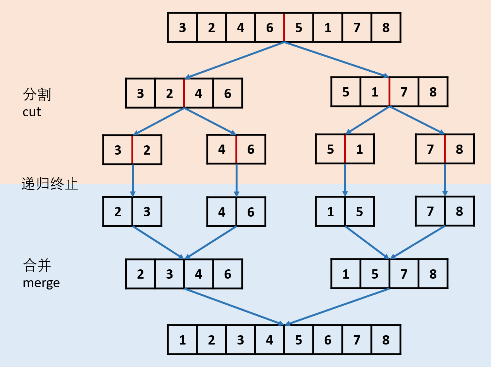

# 148. Sort List

#### 递归



```java
//通过快慢双指针确定链表中点，进行两路归并。
    public ListNode sortList(ListNode head) {
        if (head == null || head.next == null)
            return head;
        ListNode fast = head.next, slow = head;
        
        while (fast != null && fast.next!=null){
            slow = slow.next;//慢指针走一步
            fast = fast.next.next;//快指针走两步
        }
        ListNode rightHead = slow.next;//链表右边部分头节点
        slow.next = null;//将链表切断 
        //递归找中点并且分
        ListNode left = sortList(head);
        ListNode right = sortList(rightHead);
        //将左右部分按顺序合并
        return merge(left,right);
    }
    
    public ListNode merge(ListNode left, ListNode right){
        ListNode head = new ListNode(0);//新创建一个根头节点，然后让一个agent从这里开始拉链条
        ListNode dummy = head;//dummy等于head的时候，dummy链接到其他节点相当于head链接到该节点
        
        while(left != null && right != null){
            if(left.val < right.val){
                dummy.next = left;
                left = left.next;
            }else{
                dummy.next = right;
                right = right.next;
            }
            dummy = dummy.next;//dummy至始至终只是个负责拉链条的代理人，拉一个走一步
        }
        
        //若还有哪个链表还有没被比较完的值，直接把dummy链向它
        //注：每次递归回去的时候，从底层返回的链表都是有序的
        if (left != null)   dummy.next = left;
        if (right != null)  dummy.next = right;
        
        return head.next;//返回链表头节点
    }
```

